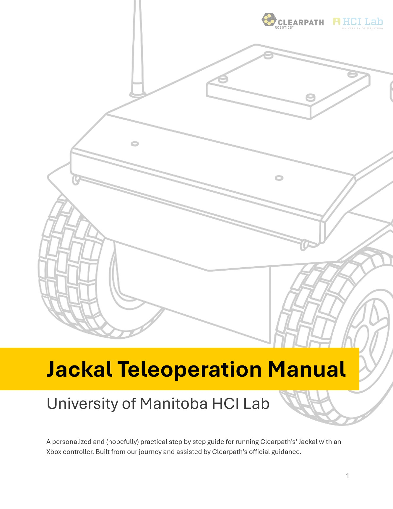
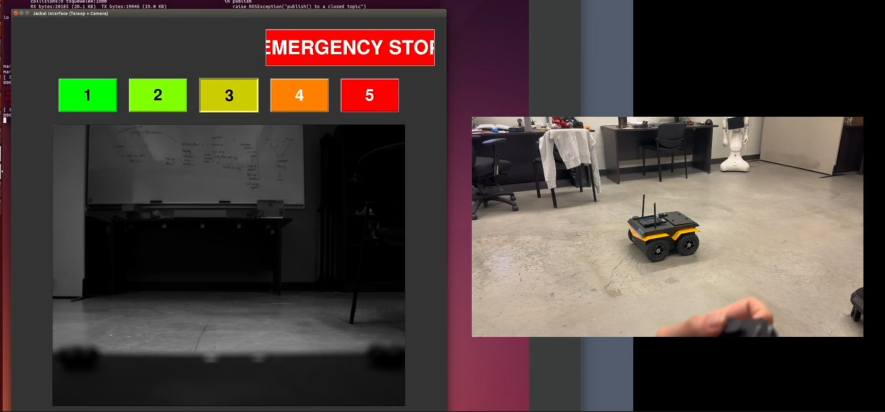
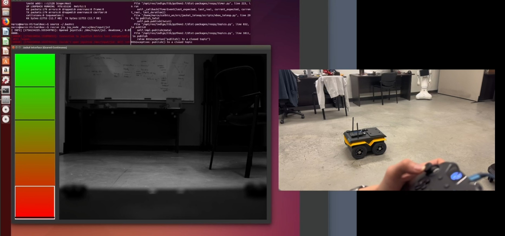

<h1 align="center">HCI Jackal: Gearing-Based Teleoperation Interfaces</h1>

<p align="center">
Robots are built to take in our every command but does it truly understand the power they hold? Imagine a robot, a machine that is practically unstopable once it sets a speed its motors. Now, imagine putting this robot in a crowded area, speeding through it with max speed. Sounds dangerous doesn't it? We propose to design and find an interface that lets operators control the speed in certain levels, creating a safer way to utilise the power of the robot. 
</p>

<p align="center">
  <a href="#"></a>
  <a href="#"></a>
  <a href="#"></a>
  <a href="#license"></a>
</p>

<hr />

## 🔎 Overview

**What this is:** A Human–Computer Interaction (HCI) project at the University of Manitoba exploring **“gearing” controls** for the Clearpath **Jackal UGV**. Gearing lets an operator work within just the part of the robot’s capability they actually need (e.g., **slow, precise motion in tight spaces**) by remapping the joystick range to a **smaller, safer speed band**. This aims to improve **usability, workload, and safety** in cluttered environments.

**Technical:** a ROS teleop node that remaps joystick input into **discrete gears** or **per-gear [min,max] windows** and publishes `geometry_msgs/Twist` to **`/cmd_vel`**.

### 📘 Jackal Teleoperation Manual (ONGOING)
<p>
  
  <br>
  <sub>Lab-made quick guide for safe, precise Jackal teleop.</sub>
</p>

<br clear="both" />

## 🎥 Demos

**Discrete Gears**
*** Click on the photo for demo ***
[](https://drive.google.com/file/d/1PcqrT4zH9PoieW-pLL0yN6xDMPK-AFh2/view?usp=sharing)

**Continuous Gear**  
[](https://drive.google.com/file/d/1PcqrT4zH9PoieW-pLL0yN6xDMPK-AFh2/view?usp=sharing)
---

## 🤔 Why Gearing?

- Robots expose a broad capability range (0–100% speed); operators rarely need all of it at once.  
- Gearing **rescales** the joystick so its full throw maps to a **smaller, safer** velocity band (e.g., 0→0.6 m/s).  
- Benefits: fewer overshoots, smoother micro-movements, **lower operator workload**, safer demos.

## 🧪 Interfaces in this Repo

1. **Base (Raw Joystick)** — direct stick→speed mapping (baseline; precise low-speed control is harder).  
2. **Geared — Discrete Levels (1–5)** — each gear is a fixed cap (e.g., Gear 2 = 0.40 m/s); bump gear up/down.  
3. **Geared — Continuous Window per Gear** — each gear defines a `[min,max]` window; stick sweeps inside that band (analog feel, safe ceiling).

---

## 🎮 Default Controls (example mapping)

- **LB**: enable motion  
- **Left stick (Y)**: forward/back  **Right stick (X)**: rotate  
- **RT / LT**: gear up / gear down  
- **Back**: emergency stop

---

## ⚡ Quick Start (ROS)

```bash
# 1) Confirm your gamepad device
ls /dev/input/          # look for js0, js1, js2 ...

# 2) Start the joystick driver
rosrun joy joy_node _dev:=/dev/input/js2

# 3) Run a teleop node (publishes /cmd_vel)
rosrun jackal_teleop xbox_teleop.py
